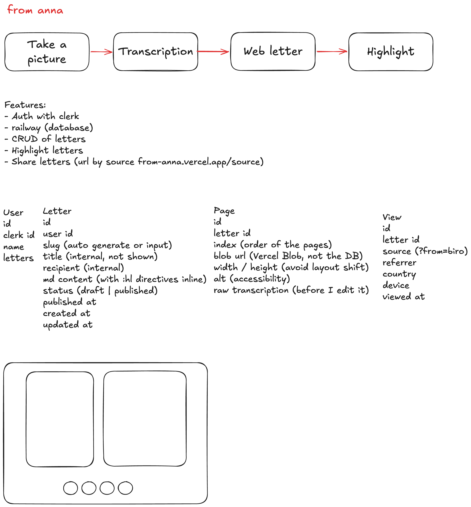

# Docs

This is everything I worked out before opening the editor.

Start with [GOAL.md](./GOAL.md). It says why this project exists, and it is short.

## The board

[board.png](./board.png) is the first drawing, made before any of the docs. The flow across the top, the feature list, the data model, and the two-pane reading layout with the page dots at the bottom.

It is kept as-is, which means it disagrees with the docs in a few places: it says Railway where the database ended up being Neon, and it writes the highlight directive as `:hl` instead of `:mark`. Those are not mistakes to fix. The board is where the thinking started, the `DECISIONS.md` files are where it landed, and being able to see the distance between the two is the point of keeping both.

## How the feature folders work

Every feature has the same two files:

- `DECISIONS.md` is a log. X because Y. No storytelling, no list of options I never seriously considered.
- `IMPLEMENTATION.md` is the plan, split into phases. Each phase has a **Done when** list and a **Checks** block covering accessibility, security, bugs, responsive, SEO and performance.

The checks are prompts to look, not boxes to tick. A check that clearly doesn't apply to the phase in front of you isn't a finding.

## Features

### [photo-transcription](./features/photo-transcription/)

Photo of the notebook page goes in, markdown comes out. Upload, image processing before sending, the vision model behind it, and the raw transcription kept untouched before any editing.

### [markdown-hightlight](./features/markdown-hightlight/)

The coloured highlights and the side brackets. They live inside the markdown as directives, like `:mark[text]{c=important}`, instead of a table of offsets in the database. That way the `.md` file carries everything by itself and fixing a typo breaks nothing.

This is also the one that becomes an npm package. The other two are app code.

### [share](./features/share/)

The published letter. Readable but unguessable slug, one link per recipient, `noindex`, page-turn navigation, and counting whether the letter was actually opened and read.

---

Yes, the folder is called `markdown-hightlight`. I noticed. (lol)
